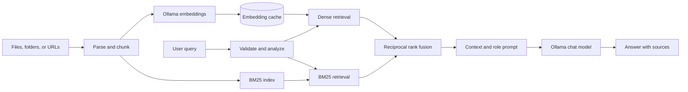
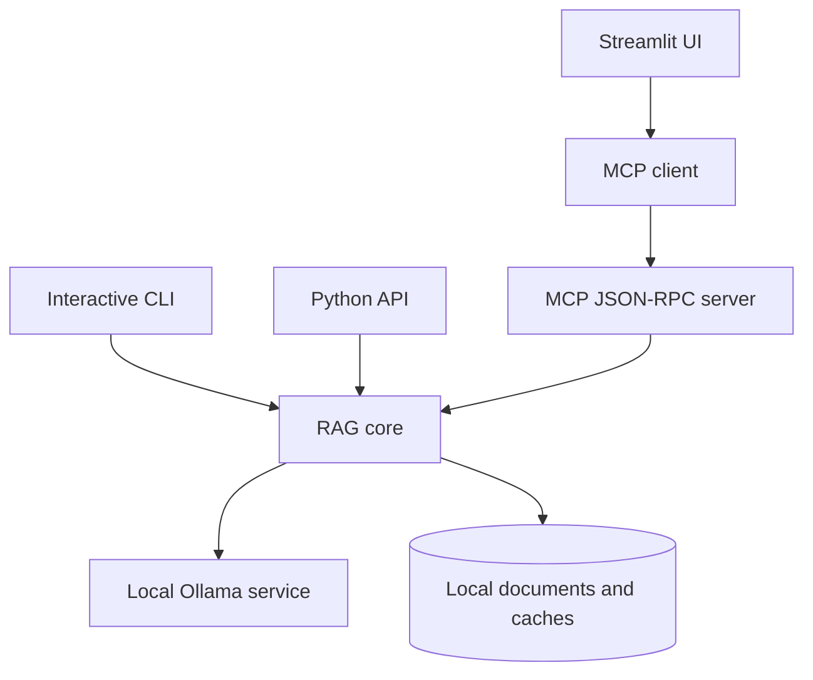

# Final RAG Chatbot

[](https://github.com/Sukalyan2003/RAG-Chatbot/actions/workflows/ci.yml)

A local-first Retrieval-Augmented Generation chatbot with Ollama, hybrid dense/BM25 search, role-aware behavior, a Streamlit UI, and a JSON-RPC Model Context Protocol (MCP) interface.

## Highlights

- Ingests PDF, DOCX, TXT, Markdown, JSON, CSV, directories, and web pages.
- Combines dense embeddings and BM25 results with reciprocal rank fusion.
- Runs against local Ollama chat and embedding models by default.
- Exposes chat, document, search, statistics, and cache operations over MCP.
- Includes direct and MCP-backed Streamlit interfaces plus CLI and Python APIs.
- Keeps generated documents, embeddings, exports, logs, and caches out of Git.

## How It Works





## Quick Start

Prerequisites: Python 3.8+, [Ollama](https://ollama.com/download), and roughly 4 GB of free RAM for the default local models.

```bash
git clone https://github.com/Sukalyan2003/RAG-Chatbot.git
cd RAG-Chatbot
python -m venv .venv
source .venv/bin/activate  # Windows PowerShell: .venv\Scripts\Activate.ps1
python -m pip install -r requirements.txt
```

Start Ollama and download the configured models:

```bash
ollama serve
ollama pull qwen3:4b-instruct
ollama pull qwen3-embedding:0.6b
```

Verify the environment, then launch one interface:

```bash
python health_check.py

# MCP-backed web UI
streamlit run src/ui/streamlit_app_mcp.py

# Or the interactive CLI
python -m src.core.final_rag_system --interactive --role User
```

Streamlit listens on `http://localhost:8501` by default. To use the optional HTTP/WebSocket MCP transports, also install `mcp-requirements.txt`.

## Programmatic Usage

```python
from src.core.final_rag_system import FinalRAGChatbot

with FinalRAGChatbot(role="User") as bot:
    bot.load_documents("data/documents/")
    print(bot.chat("Summarize the loaded documents"))
```

`load_documents` accepts a single supported file, a recursively scanned directory, a URL, or a list of those sources. Duplicate chunks are skipped on repeated loads.

## Test

The automated suite uses fake numeric and Ollama integrations, so CI does not download models or call a live service.

```bash
python -m pip install -r requirements.txt -r requirements-dev.txt
python -m pytest -q
```

The tests cover configuration, input validation, multi-format parsing, hybrid retrieval, cache compatibility, MCP initialization and tools, deduplication, streaming, and end-to-end load/chat behavior.

## Configuration and Data

Runtime settings live in [`config/config.json`](config/config.json), including model names, retrieval limits, role permissions, paths, security controls, and hardware auto-tuning. Local documents, embeddings, logs, and exports belong under `data/`; the repository keeps only `.gitkeep` placeholders in those directories.

Do not add private documents, API keys, embeddings derived from sensitive data, or runtime logs to version control.

## Documentation

- [Complete system reference](docs/README.md)
- [Quick-start guide](docs/QUICKSTART.md)
- [MCP setup](docs/MCP_QUICKSTART.md)
- [Streamlit guide](docs/STREAMLIT_GUIDE.md)
- [MCP conversion notes](docs/MCP_CONVERSION_SUMMARY.md)
